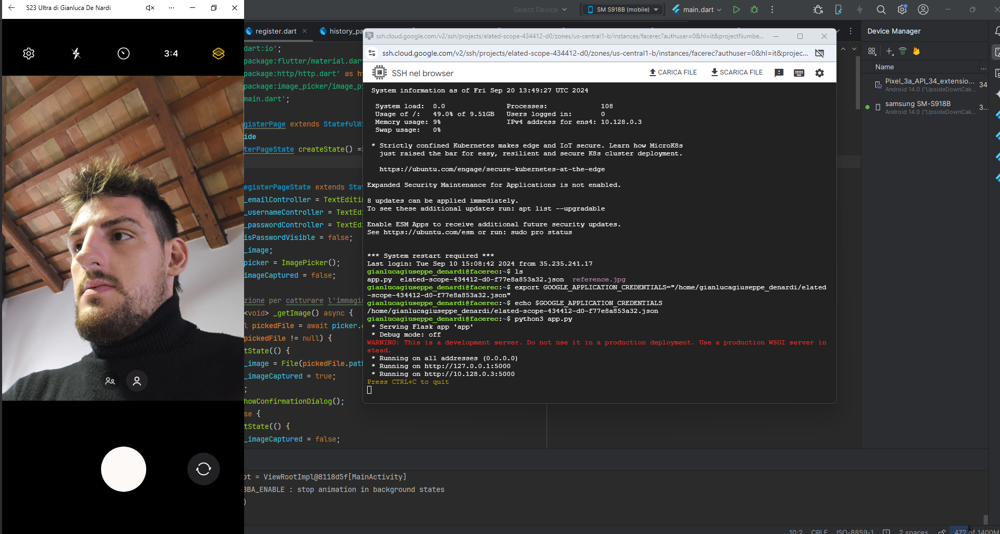
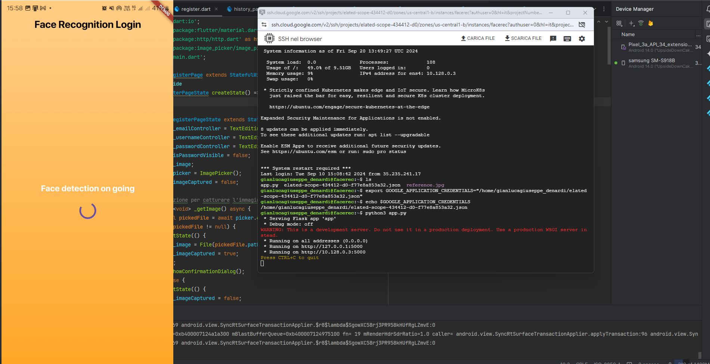
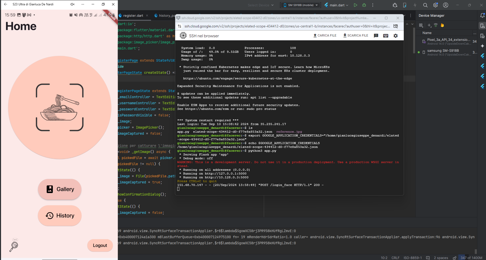
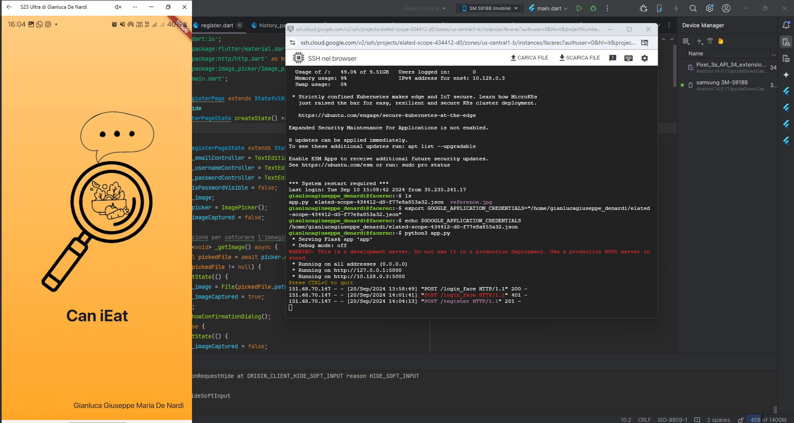
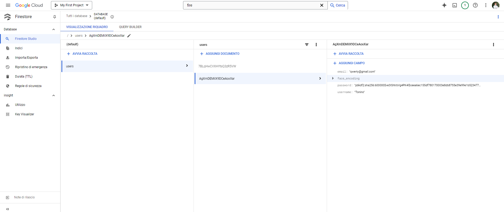
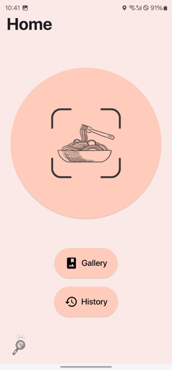
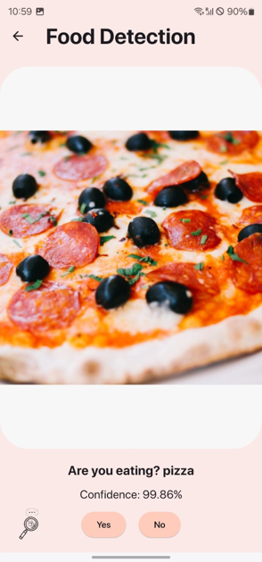
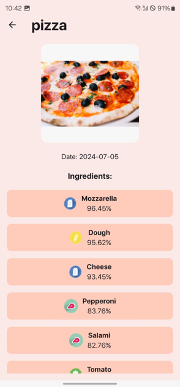
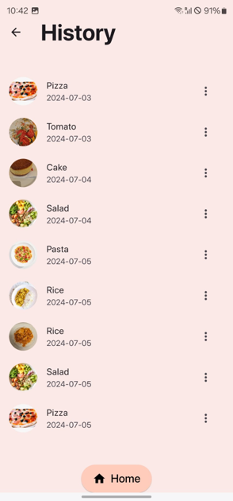

<h1 align="left">
  
  CAN I EAT | Food Recognition AI APP | AI Face Log-In Security System
</h1>

## 🧩 Project Overview

This project integrates two core components into a cohesive mobile-first solution: a **secure face recognition log-in system** and a **real-time food recognition app** called *CAN I EAT*. Both modules are designed with a strong focus on **usability**, **privacy**, and **real-world applicability**, particularly in the fields of **health monitoring** and **secure user access**.  
The application is compatible with both **Android** and **Apple** platforms.

---

## 🛠️ Tech Stack

| Component      | Technology                                  |
|------------------|-------------------------------------------|
| Frontend App     |  Flutter (Dart) via Android Studio / Xcode|
| Backend API      | Python (Flask)                            |
| Face Recognition | `face_recognition`, OpenCV                |
| Authentication   | bcrypt, PBKDF2 + SHA-256                  |
| Cloud Hosting    | Google Cloud VM (Linux)                   |
| Database         | Google Firestore (NoSQL)                  |

---

### 🔐 [Face Recognition Log-In System](#face-recognition-log-in-system)

The first component focuses on **biometric authentication** using facial recognition as a primary method of user identification. The system ensures that only authorized users can access sensitive features of the app. It leverages:

- A **secure cloud infrastructure** via Google Cloud VM and Firestore
- **Modern encryption** with PBKDF2 (SHA‑256) and `bcrypt` for passwords
- AI-based face encoding with the Python library `face_recognition`
- Optional fallback to traditional username + password access

This module prioritizes **data protection** and conforms to high standards of **cybersecurity** for mobile applications.

---

### 🍲 [CAN I EAT – Food Recognition App](#can-i-eat--mobile-app-integration)

The second part, *CAN I EAT*, is a smart mobile assistant designed to help users **identify food items using the device camera**, detect potential **allergens**, and maintain a **food history log**. It features:

- Real-time inference via the **Clarifai food recognition API**
- A Dart-based backend that handles HTTP requests and response parsing
- Confidence filtering (threshold 55%) for prediction clarity
- A modern UI built in Android Studio with gallery and history integration

The app allows users to take or select a photo, analyze it through the AI model, and view details such as food names, ingredients, and allergen icons.

---

### 🎯 Vision

By combining **computer vision**, **cloud security**, and **user-centered design**, this project demonstrates how AI technologies can be effectively applied to support both **personal security** and **healthy living**, all within an intuitive and cohesive mobile experience.


---

## 🧰 User Manual – Setup & Deployment Instructions

This section describes how to set up the facial recognition system and test the mobile application end-to-end.

### ⚙️ Backend Setup (Face Recognition API)

1. **Launch the `app.py` server** on a secure virtual machine (VM).
2. **Download your personal credentials** from Google Cloud in `.json` format, to ensure secure, user-specific data access.
3. **Upload credentials to the VM** and set the environment variable:
   ```bash
   export GOOGLE_APPLICATION_CREDENTIALS="/home/gianlucagiuseppe_denardi/elated-scope-434412-d0-f77e8a853a32.json"
4. **Start the backend service** with:
   ```bash
   python3 app.py

### 📱 Mobile App Setup (Flutter)

To install and explore the mobile application:

1. 📦 **Download the APK file** to install the app on an Android device:
    ```bash
     app-release.apk
2. 🧾 **Flutter source code** is located in:
    ```bash
     app-release.apk
3.🛠️ **Main project pages** you can customize:
         - `face_login.dart`
         - `login.dart`
         - `register.dart`
         - `main.dart`
         
### 🧪 Facial Recognition Test (Standalone)

To manually test the facial recognition pipeline:

1. Open the `test` directory.
2. Replace the image file `reference.jpg` with your own facial image.
3. Run the Jupyter notebook:
   ```bash
   test.ipynb
---

---

## 🔐 Facial Recognition – Login Flow

### 📸 Step 1 – Face Captured


### ✅ Step 2 – Face Recognized (Login Successful)


### ❌ Step 3 – Face Not Recognized (Fallback to Manual Login)


---

## 📝 User Registration & Firestore Storage

### 📲 Registration Request Sent from App


### 🗃️ Firestore – New User Record (Encrypted)



---

## 📲 CAN I EAT – App Screens

Below are some key screens of the *CAN I EAT* mobile app, built in Flutter using Dart. The interface is designed for intuitive interaction and AI-powered food analysis.

### 🔸 Splash Screen


A minimal splash screen featuring the logo, designed to match the theme and introduce the app brand.

---

### 🏠 Home Page


Main entry point with a round button to capture food images. Users can also access their photo gallery and detection history.

---

### 🍽️ Food Detection Result


The app returns results with a confidence percentage. If the score is above a threshold, the result is shown and the user can confirm or retake.

---

### 🖼️ Gallery Page


Alternative input method: users can choose an image from the gallery to detect food instead of using the camera.

---

### 📑 Detail Page


Displays ingredients and allergen icons for each detected item, improving clarity and health awareness.

---

### 🕓 History Page


Shows past detection results organized by date. Each entry includes an image preview, food label, and editing options.

---


## 👨‍🎓 Author

**Gianluca Giuseppe Maria De Nardi**  
Double Master's Graduate in AI & IoT Engineering  
University of Udine & University of Klagenfurt

